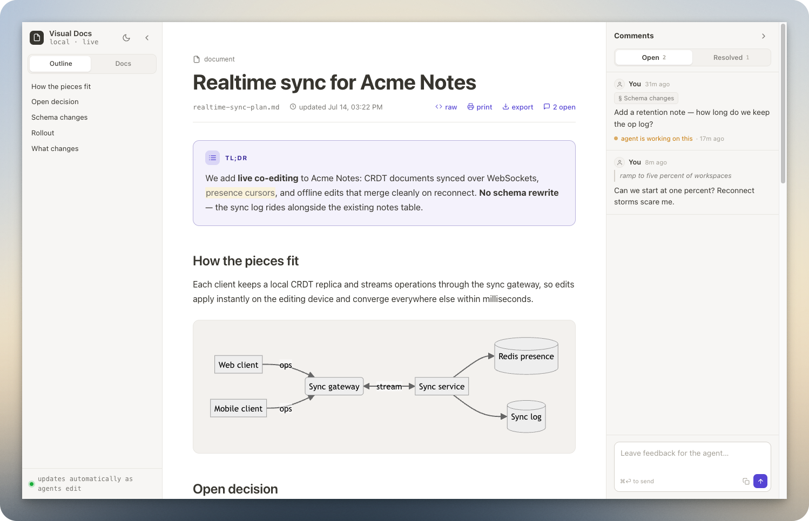

# patrickdappollonio's Claude plugins

My collection of Claude (and other AI's) skills, plugins, MCP servers, and more — packaged as a [Claude Code plugin marketplace](https://code.claude.com/docs/en/plugin-marketplaces) so you can install any of them with one command. Not on Claude Code? The same collection installs into 75+ other agents with [`npx skills`](https://github.com/vercel-labs/skills) — see [Installing](#installing).

## Installing

There are two ways in, and they install the same skills from the same repository. Pick the one that matches your agent.

### Claude Code

```
/plugin marketplace add patrickdappollonio/claude-plugins
```

That registers this marketplace under the name `patrickdappollonio`. You only do this once; afterwards every plugin below is available to install with the command shown in its section.

### Any other AI agent — Cursor, Codex, Copilot, opencode, Gemini, Windsurf…

Use [`npx skills`](https://github.com/vercel-labs/skills), Vercel's open skills installer, which supports 75+ agents. It reads this repository's marketplace file directly, so nothing extra is needed on your side:

```bash
# pick interactively from the whole collection
npx skills add patrickdappollonio/claude-plugins

# or install specific skills without prompting
npx skills add patrickdappollonio/claude-plugins --skill adversarial-review

# everything, into every agent it detects
npx skills add patrickdappollonio/claude-plugins --all
```

Add `-g` to install for your user instead of the current project, and `-a <agent>` to target one agent (`npx skills add … -a cursor`). Update later with `npx skills update`.

To install several, repeat the flag — `--skill a --skill b`. A comma-separated list matches nothing and silently installs nothing, so don't use one.

Each plugin below maps to one skill of the same name, except `visual-docs`, which provides two:

| Plugin | `--skill` name(s) |
|---|---|
| adversarial-review | `adversarial-review` |
| appropriate-comments-code | `appropriate-comments-code` |
| code-simplification | `code-simplification` |
| effective-communicator | `effective-communicator` |
| read-the-docs-first | `read-the-docs-first` |
| use-claude-limits-efficiently | `use-claude-limits-efficiently` |
| use-premium-models-efficiently | `use-premium-models-efficiently` |
| visual-docs | `visual-plan`, `visual-recap` |

> Skills installed this way run with your agent's full permissions, the same as any other skill. They are plain markdown — read them before you install them.

## Plugins

### adversarial-review

A hostile, bias-free review of a change — a PR, the last commit, or your
uncommitted work. Most reviews are friendly: the reviewer shares your context
and quietly assumes the code works. This one doesn't. It dispatches a panel of
17 independent reviewers, each a fresh sub-agent with no knowledge of your
conversation or your rationalizations, and each told one thing: *assume the
change is broken and prove it*. Concurrency races, hostile inputs,
authorization gaps, resource exhaustion, hollow AI-generated code, unverified
factual claims — each angle gets its own attacker.

The reviewers get exactly one piece of context: what the change was **agreed**
to do, and what it was agreed *not* to do. That's the difference between a
panel that checks whether the right thing was built and one that hunts bugs in
a faithful implementation of the wrong design — and it stops every deliberate
omission from being reported as a gap. One reviewer does nothing else: it holds
the code against the plan or mock you signed off on, element by element, and
chases where the data from anything dropped ended up instead.

A standalone false-positive filter re-checks every finding against the actual
code before anything reaches you, so the report contains only verified
problems, each with a validated fix proposed. And the report is written for
someone who never read the code — plain sentences, effect first, in Simplified
Technical English. The agents did the grepping; you shouldn't have to open a
file to understand what they found. Symbol names appear in one place only: the
clickable `file:line` under each finding.

```
/plugin install adversarial-review@patrickdappollonio
```

Then just ask: *"Give this change an adversarial review."* [Read more →](plugins/adversarial-review)

### appropriate-comments-code

Comment discipline for the code your agent writes, on one rule: **every comment
carries information the code does not, and describes the current state only.**
The audience is a developer months from now who was not in the session, did not
read the PR, does not know what was tried first, and cannot ask. If a sentence
only makes sense to someone who watched the code being written, it doesn't
belong in the code.

That rules out three things agents do constantly. Narrating the journey — *"we
used to buffer the whole response but it blew up memory, so now we stream it"* —
describes an edit, not the code, and rots on the next change; the standing
constraint gets stated instead. Restating the line below — *"// Opens the DB
connection"* above `connection.open()` — costs the reader time for nothing.
And committing identifiers that outlive nothing: finding numbers like `F7`,
iteration labels, wave and task IDs, agent run labels. Those mean something to
exactly one person for about a day, and then sit in the file forever.

Nothing gets thrown away, it gets routed: a regression is pinned by a test named
after the invariant (a comment saying *"don't remove this check"* fails nobody's
build), the reasoning goes in the commit message, review findings stay in the
review thread. And it's explicit about what *does* earn a comment — external
constraints, invariants callers must uphold, units and ownership, upstream-bug
workarounds with their exit condition, public API docs.

```
/plugin install appropriate-comments-code@patrickdappollonio
```

Then just write code — it loads itself. [Read more →](plugins/appropriate-comments-code)

### code-simplification

Language-agnostic code simplification that reduces complexity — deep nesting,
long functions, duplicated logic, dead code, unclear names — while preserving
behavior exactly. The goal is not fewer lines; it's code a new team member
would understand faster. It blends [Anthropic's code-simplifier](https://github.com/anthropics/claude-plugins-official/blob/main/plugins/code-simplifier/agents/code-simplifier.md),
[Addy Osmani's code-simplification skill](https://github.com/addyosmani/agent-skills/blob/main/skills/code-simplification/SKILL.md),
and [Happycapy's code-simplification skill](https://happycapy.ai/skills/code-simplification)
into one process.

The discipline is the point: it understands code before touching it
(Chesterton's Fence), applies one tested change at a time, refuses drive-by
refactors outside the requested scope, and if a test fails after a change, it
reverts the change — never the test.

```
/plugin install code-simplification@patrickdappollonio
```

Then just ask: *"Simplify what we just wrote."* [Read more →](plugins/code-simplification)

### effective-communicator

Plain language by default, for the reader who **can't see the code you can
see.** Agent findings routinely arrive as a wall of file names, function names,
and variable names — which shifts the work of understanding onto the one person
who can't open the file. This skill makes the agent translate every identifier
into what it actually does, lead with the outcome rather than the label, and
write in Simplified Technical English (ASD-STE100): short sentences, one idea
each, active voice, no unexplained jargon.

It also writes for how attention actually works — the important point lands in
the last message of the turn instead of scrolling off behind a pile of tool
calls — and it never drops a real finding just to be brief. When a reader
answers in code terms, it matches them for that exchange, then resets. It pairs
naturally with `adversarial-review` and any audit or debugging pass that
produces identifier-heavy output.

```
/plugin install effective-communicator@patrickdappollonio
```

Then just ask: *"Explain that in plain English."* — or install it and never ask
again. [Read more →](plugins/effective-communicator)

### read-the-docs-first

Docs-first discipline for anything external or fast-moving. Model memory ages
— APIs drift, majors ship, defaults change — so this skill makes the agent
web-search for current official docs and read primary sources before writing
code or answering from memory. It defines concrete triggers (new packages,
provider SDKs, auth/billing/webhook flows, API-drift errors, "latest/official"
requests), ranks what counts as authoritative, and requires naming the sources
consulted. A work-friendly rewrite of the `read-the-damn-docs` skill.

```
/plugin install read-the-docs-first@patrickdappollonio
```

Then just ask: *"Add Stripe webhooks to this app — check the current docs first."* [Read more →](plugins/read-the-docs-first)

### use-claude-limits-efficiently

A budget loop for long-running or parallel agent work under Claude's 5-hour
and weekly usage limits — a rewrite of [`stay-within-limits` from
@agent-native/skills](https://www.npmjs.com/package/@agent-native/skills). The
agent runs work in bounded waves, checks real observed usage between waves
(via a host usage tool or `ccusage`), pauses new work at 95% of either window,
and resumes only after confirming the window actually rolled over — comparing
block timestamps, never trusting elapsed wall-clock time. Wake prompts are
self-contained, and wakeups chain past runtime clamps so overnight pauses
work.

```
/plugin install use-claude-limits-efficiently@patrickdappollonio
```

Then just ask: *"Migrate all 340 handlers overnight, but don't blow through my usage limits."* [Read more →](plugins/use-claude-limits-efficiently)

### use-premium-models-efficiently

Run a premium model where it is worth paying for judgment — a rewrite of
[`efficient-fable` from
@agent-native/skills](https://www.npmjs.com/package/@agent-native/skills),
generalized beyond Claude Fable: it works for any premium/cheap split, whether
that's Fable or Opus orchestrating Sonnet/Haiku, or OpenAI's GPT-5.6 Sol
orchestrating Terra/Luna. The expensive model keeps decomposition,
architecture, synthesis, and final review; cheaper subagents do the
token-heavy scans, log reduction, bounded edits, and testing passes. Every
delegation is a self-contained handoff packet with scope, evidence format, and
stop conditions, and subagent reports are treated as leads, not facts — the
premium model re-verifies cited evidence before declaring work done.

```
/plugin install use-premium-models-efficiently@patrickdappollonio
```

Then just ask: *"Find and fix the double-charge bug in this monorepo — delegate the heavy lifting."* [Read more →](plugins/use-premium-models-efficiently)

### visual-docs

Fully local visual plans and recaps — a take on [BuilderIO's `/visual-plan`
and `/visual-recap` skills](https://github.com/BuilderIO/skills) with no hosted
service, no accounts, and nothing leaving your machine. The agent writes a
markdown document and serves it on a random localhost port with a bundled
zero-dependency Node server: Mermaid and nomnoml diagrams, rich diffs, DB
migration cards, API call cards, and a read-only OpenAPI view.

The page live-reloads as the agent edits, and you can pin comments to any
section — the agent reads them before revising, closing the feedback loop
without leaving your browser.



```
/plugin install visual-docs@patrickdappollonio
```

Then just ask: *"Give me a visual plan for adding rate limiting to the API"* or *"Visual recap of PR 142."* [Read more →](plugins/visual-docs)

## Updating

When I push new plugins or new versions, refresh your local copy.

Claude Code:

```
/plugin marketplace update patrickdappollonio
```

Everywhere else:

```bash
npx skills update
```

## Contributing / issues

Found a bug or have a request? Open an issue on this repository.
