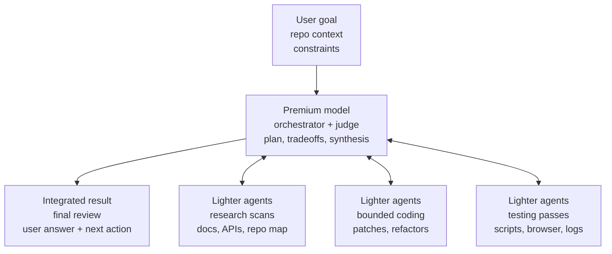

# Use Premium Models Efficiently

Use a premium model where it is worth paying for judgment.

This skill teaches an expensive top-tier model to run codebase-heavy work
without spending premium tokens on every scan, log read, browser run, and
bounded edit. The premium model keeps the hard calls — decomposition,
architecture, tradeoffs, synthesis, risk, and final review — while cheaper
subagents do the repeatable heavy passes.

It is model-neutral: the split is by relative cost, not brand. With Anthropic
that means Claude Fable or Opus orchestrating Sonnet/Haiku subagents; with
OpenAI's GPT-5.6 family it means Sol orchestrating Terra/Luna. When model
names change, the rule stays: the most expensive model takes the judgment
seat, the cheaper tiers take the bounded heavy lifting.



## What it does

- Splits large work into research, coding, and testing lanes run by cheaper
  subagents, while the premium model chooses the strategy, the validation
  direction, and the review bar.
- Requires **self-contained handoff packets** for every delegation: repo path,
  exact objective, in-scope and out-of-scope surfaces, the evidence format to
  return, verification commands, and explicit stop conditions — so a lighter
  agent stops and reports instead of improvising when reality doesn't match
  the prompt.
- Treats subagent reports as **leads, not facts**: before acting on a
  high-impact finding, opening a PR, or declaring work done, the premium model
  reopens the cited files and confirms the evidence itself.

## When to use it

Use it when the task is too broad for one expensive model pass: unfamiliar
repos, long test output, multi-file changes, product/architecture ambiguity,
or validation work that can run in parallel.

Skip it for tiny fixes, highly coupled edits, or judgment-sensitive debugging
where delegating would create more coordination cost than it saves.

## Installing

Add the marketplace, then install the plugin:

```
/plugin marketplace add patrickdappollonio/claude-plugins
/plugin install use-premium-models-efficiently@patrickdappollonio
```

## Running it

The skill activates on its own when a premium model faces token-heavy work
with subagents available, or you can invoke it explicitly:

```
/use-premium-models-efficiently:use-premium-models-efficiently
```

## Inspiration

A rewrite of the [`efficient-fable` skill from
@agent-native/skills](https://www.npmjs.com/package/@agent-native/skills),
generalized beyond Claude Fable to any premium/cheap model split, trimmed to
the guidance that measurably changes agent behavior, and with the diagram
inlined as Mermaid so the skill stays a single lean file.
