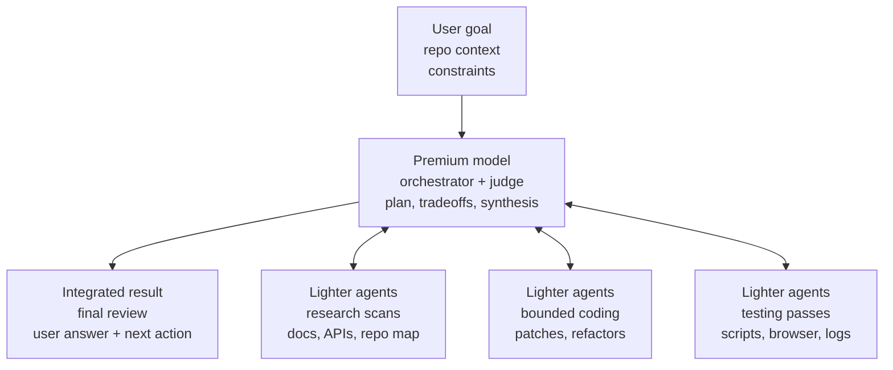

# Use Premium Models Efficiently

The premium model is the orchestrator, architect, synthesizer, and final judge.
Cheaper subagents do the token-heavy research, coding, testing, and
summarization that doesn't require its full judgment.

## Which Models Are Which

The split is by relative cost within whatever provider you're running, not by
brand. As of mid-2026:

| Provider | Premium (orchestrator + judge) | Cheaper (subagents) |
|---|---|---|
| Anthropic | Claude Fable, Claude Opus | Claude Sonnet, Claude Haiku |
| OpenAI | GPT-5.6 Sol | GPT-5.6 Terra, GPT-5.6 Luna |

Model families evolve; when these names are stale, apply the same rule — the
most expensive available model takes the judgment seat, the cheaper tiers take
the bounded heavy lifting.

## Keep with the Premium Model

- Decomposing ambiguous work into clean parallel slices.
- Architecture, product, and safety tradeoffs.
- Reading conflicting subagent reports and deciding what matters.
- Integrating partial implementations into one coherent result.
- Final review, risk assessment, and user-facing synthesis.

## Delegate to Cheaper Subagents

1. Spot the heavy lifting — you can't predict token counts, but you can
   recognize the shapes that always burn them: large repo search, long logs,
   broad docs, repetitive edits.
2. Split independent work into subagents **before** reading everything
   yourself.
3. Use cheaper models for research scans, inventory, search summaries, narrow
   bug hunts, browser/testing passes, test-output reduction, and bounded code
   edits.
4. Ask subagents for concise evidence: files, line references, commands run,
   diffs, uncertainties, and stop conditions they hit.
5. Spend premium tokens on the decision layer: compare results, resolve
   conflicts, choose the implementation path, review the final patch.

Prefer parallel subagents when slices don't depend on each other. Keep
blocking or highly coupled work local.

## Handoff Packets

Write every delegated prompt as if the subagent has no useful chat context —
because it doesn't. Each packet contains:

- The repo path and exact objective.
- The files, packages, or surfaces in scope, and anything explicitly **out**
  of scope.
- The evidence format to return: files, line refs, commands, diffs, failures,
  screenshots, and uncertainty.
- The verification commands or browser flows to run, plus what success should
  look like when that is knowable.
- Stop conditions: if the code doesn't match the prompt, a command fails after
  a reasonable retry, or the task needs out-of-scope files — **stop and report
  instead of improvising**.

## Vet Delegated Work

Treat subagent reports as leads, not facts. Before acting on a high-impact
finding, opening a PR, or telling the user the work is done, reopen the
important cited files, confirm the relevant line refs or failures, and review
the final diff against the task. Lighter agents gather signal;
truth-judgment stays with the premium model.

## Scenario Defaults

Soft defaults, not rigid rules:

| Work | Lighter agents do | Premium model does |
|---|---|---|
| Research | Scan docs, prior art, APIs, repo surfaces | Decide what evidence changes the plan |
| Coding | Bounded edits, candidate patches | Shared-file coordination, integration, final review |
| Testing | Run targeted tests, browser flows, screenshots; reduce logs; report exact commands, failures, and whether failures look flaky, environmental, or real | Choose the validation direction and the checks that matter; judge the signal |
| Debugging | Cluster logs, reproduce issues, try small fixes | Decide which diagnosis is most trustworthy |

## When Not to Delegate

If a task is tiny, highly coupled, or the validation itself needs delicate
judgment, keep it with the premium model — delegating would cost more in
coordination than it saves.
