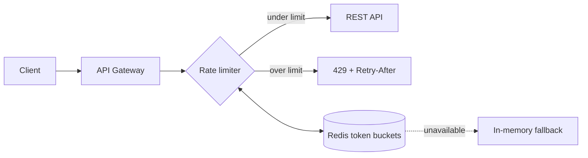

# Add rate limiting to the public API

```tldr
Adds a **token-bucket** rate limiter in front of the public API — over-limit
requests get `429` with a `Retry-After` header. Limits are per API key in Redis,
with an in-memory fallback. Default is **100 req/min**, behind a rollout flag.
```

## Summary

We will add a token-bucket rate limiter in front of the public REST API. Requests over the limit get `429 Too Many Requests` with a `Retry-After` header. Limits are per API key, stored in Redis, with an in-memory fallback when Redis is unavailable.

> **Decision needed:** default limit of 100 req/min per key — is that acceptable for the enterprise tier, or do we need per-tier limits at launch?

## Files touched

The change spans the limiter package, its wiring, config, a migration, and tests:

```filetree
# Server
A  internal/ratelimit/bucket.go      Core **token-bucket** with `Take(key)` and `Refill()`; backs onto Redis via `INCR`+`EXPIRE`, falling back to an in-memory `sync.Map` when Redis is unreachable.
A  internal/ratelimit/middleware.go  chi middleware that calls `Take` per request and, on rejection, writes `429` with a `Retry-After` header computed from the bucket's next-refill time.
M  internal/server/router.go         Wires the limiter in front of `/api/v1` *before* auth, so unauthenticated floods are shed cheaply.
M  internal/config/config.go         Adds `RATE_LIMIT_RPM` (default `100`) and `REDIS_URL`; both are optional — omitting `REDIS_URL` selects the in-memory store.

# Database
A  migrations/0007_api_key_limits.sql  Per-key limit *overrides* table so enterprise keys can exceed the global default.

# Tests
A  internal/ratelimit/bucket_test.go   Burst, steady-refill, and Redis-down fallback cases; asserts `Retry-After` is monotonic.
M  internal/server/router_test.go      End-to-end assertion that the 101st request in a minute gets `429`.
```

## Architecture

Every request passes through the limiter before hitting the API; rejects short-circuit with a `429`:



## Limiter states

A sketch-style view of the same flow, for contrast:

```nomnoml
#stroke: #33322E
[<start> request] -> [check bucket]
[check bucket] -> [<choice> tokens left?]
[tokens left?] yes -> [serve request]
[tokens left?] no -> [<state> 429 Too Many Requests]
[serve request] -> [<end> done]
```

## Key changes

### New middleware

```go
func RateLimit(store limiter.Store) func(http.Handler) http.Handler {
    return func(next http.Handler) http.Handler {
        return http.HandlerFunc(func(w http.ResponseWriter, r *http.Request) {
            key := apiKeyFrom(r)
            res, err := store.Take(r.Context(), key)
            if err != nil || res.Allowed {
                next.ServeHTTP(w, r)
                return
            }
            w.Header().Set("Retry-After", strconv.Itoa(res.RetryAfterSeconds))
            http.Error(w, "rate limit exceeded", http.StatusTooManyRequests)
        })
    }
}
```

### Router wiring

The limiter middleware is mounted in front of `/api/v1`, before the routes it protects:

```diff
--- a/internal/server/router.go
+++ b/internal/server/router.go
@@ -12,6 +12,7 @@ func NewRouter(deps Deps) http.Handler {
 	r := chi.NewRouter()
 	r.Use(middleware.RequestID)
 	r.Use(middleware.Logger)
+	r.Use(ratelimit.RateLimit(deps.LimiterStore))
 	r.Mount("/api/v1", apiRoutes(deps))
 	return r
 }
```

## Database changes

A new table stores per-key limit overrides, with a reversible migration:

```migration
-- name: add api_key_limits table
-- up
CREATE TABLE api_key_limits (
    api_key_id  UUID PRIMARY KEY REFERENCES api_keys (id),
    per_minute  INTEGER NOT NULL DEFAULT 100,
    created_at  TIMESTAMPTZ NOT NULL DEFAULT now()
);

CREATE INDEX idx_api_key_limits_key ON api_key_limits (api_key_id);

-- down
DROP INDEX idx_api_key_limits_key;
DROP TABLE api_key_limits;
```

## API behavior

When a key exceeds its budget, the API responds like this:

```api
> POST /api/v1/orders HTTP/1.1
> authorization: Bearer sk-•••
> content-type: application/json

{"sku": "A-1001", "qty": 2}

< HTTP/1.1 429 Too Many Requests
< retry-after: 12
< content-type: application/json

{"error": "rate_limit_exceeded", "retry_after_seconds": 12}
```

## API surface

The admin endpoints for reading and setting a key's limit:

```openapi
openapi: 3.0.3
info:
  title: Rate limit admin API
  version: 1.2.0
paths:
  /admin/limits/{apiKeyId}:
    get:
      summary: Read the configured limit for a key
      parameters:
        - name: apiKeyId
          in: path
          required: true
          schema: { type: string, format: uuid }
      responses:
        "200":
          description: Current limit
          content:
            application/json:
              schema:
                type: object
                required: [per_minute]
                properties:
                  per_minute: { type: integer }
                  updated_at: { type: string, format: date-time }
        "404":
          description: Key not found
        "429":
          description: Rate limited — the admin API is itself throttled
          content:
            application/json:
              schema:
                type: object
                properties:
                  error: { type: string }
                  retry_after_seconds: { type: integer }
    put:
      summary: Set a custom limit for a key
      requestBody:
        content:
          application/json:
            schema:
              type: object
              required: [per_minute]
              properties:
                per_minute: { type: integer }
      responses:
        "204":
          description: Limit updated
        "400":
          description: Invalid per_minute value
        "404":
          description: Key not found
```

## Rollout

1. Ship middleware behind `RATE_LIMIT_ENABLED=false`.
2. Enable in staging, watch `rate_limit_rejections_total`.
3. Enable in production per-region.

> [!NOTE]
> The limiter is a no-op until `RATE_LIMIT_ENABLED=true`, so shipping the code is
> safe to do ahead of the rollout.

> [!WARNING]
> Enabling this in production immediately sheds traffic over the limit — roll it
> out per-region and watch `rate_limit_rejections_total` before going global.

> [!TIP]
> Set a generous per-key override for internal services in `api_key_limits` so
> health checks and dashboards aren't throttled.

## Open questions

```question
Should websocket connections count against the same bucket?
WS connections are long-lived, so counting each *message* differs from counting each HTTP request. This affects how `Retry-After` is computed for streaming clients.
- Yes — one bucket per key across all protocols
- No — a separate, higher WS budget
- Exempt WS entirely for now
```

```question
multiple
Which of these should ship in the first release?
- Per-key overrides table
- Redis-backed store
- In-memory fallback
- Prometheus rejection metric
```
